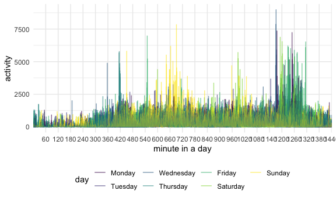
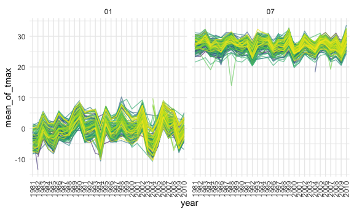

p8105\_hw3\_yl4606
================
Yubei Liang
10/9/2020

### Problem 1

``` r
data("instacart")
```

This dataset contains 1384617 rows and 15 columns.

Observations are the level of items in orders by user. There are user /
order variables – user ID, order ID, order day, and order hour. There
are also item variables – name, aisle, department, and some numeric
codes.

1.  How many aisles, and which are most items from?

<!-- end list -->

``` r
instacart %>% 
    count(aisle) %>% 
    arrange(desc(n))
```

    ## # A tibble: 134 x 2
    ##    aisle                              n
    ##    <chr>                          <int>
    ##  1 fresh vegetables              150609
    ##  2 fresh fruits                  150473
    ##  3 packaged vegetables fruits     78493
    ##  4 yogurt                         55240
    ##  5 packaged cheese                41699
    ##  6 water seltzer sparkling water  36617
    ##  7 milk                           32644
    ##  8 chips pretzels                 31269
    ##  9 soy lactosefree                26240
    ## 10 bread                          23635
    ## # … with 124 more rows

There are 134 aisles and fresh vegetables are the one most items from.

2.  Let’s make a plot

<!-- end list -->

``` r
instacart %>% 
    count(aisle) %>% 
    filter(n > 10000) %>% 
    mutate(
        aisle = factor(aisle),
        aisle = fct_reorder(aisle, n)
    ) %>% 
    ggplot(aes(x = aisle, y = n)) + 
    geom_point() + 
    theme(axis.text.x = element_text(angle = 90, vjust = 0.5, hjust = 1))
```


3.  Let’s make a table\!\!

<!-- end list -->

``` r
instacart %>% 
    filter(aisle %in% c("baking ingredients", "dog food care", "packaged vegetables fruits")) %>% 
    group_by(aisle) %>% 
    count(product_name) %>% 
    mutate(rank = min_rank(desc(n))) %>% 
    filter(rank < 4) %>% 
    arrange(aisle, rank) %>% 
    knitr::kable()
```

| aisle                      | product\_name                                 |    n | rank |
| :------------------------- | :-------------------------------------------- | ---: | ---: |
| baking ingredients         | Light Brown Sugar                             |  499 |    1 |
| baking ingredients         | Pure Baking Soda                              |  387 |    2 |
| baking ingredients         | Cane Sugar                                    |  336 |    3 |
| dog food care              | Snack Sticks Chicken & Rice Recipe Dog Treats |   30 |    1 |
| dog food care              | Organix Chicken & Brown Rice Recipe           |   28 |    2 |
| dog food care              | Small Dog Biscuits                            |   26 |    3 |
| packaged vegetables fruits | Organic Baby Spinach                          | 9784 |    1 |
| packaged vegetables fruits | Organic Raspberries                           | 5546 |    2 |
| packaged vegetables fruits | Organic Blueberries                           | 4966 |    3 |

4.  Apples vs ice cream..

<!-- end list -->

``` r
instacart %>% 
    filter(product_name %in% c("Pink Lady Apples", "Coffee Ice Cream")) %>% 
    group_by(product_name, order_dow) %>% 
    summarize(mean_hour = mean(order_hour_of_day)) %>% 
    pivot_wider(
        names_from = order_dow,
        values_from = mean_hour
    )
```

    ## `summarise()` regrouping output by 'product_name' (override with `.groups` argument)

    ## # A tibble: 2 x 8
    ## # Groups:   product_name [2]
    ##   product_name       `0`   `1`   `2`   `3`   `4`   `5`   `6`
    ##   <chr>            <dbl> <dbl> <dbl> <dbl> <dbl> <dbl> <dbl>
    ## 1 Coffee Ice Cream  13.8  14.3  15.4  15.3  15.2  12.3  13.8
    ## 2 Pink Lady Apples  13.4  11.4  11.7  14.2  11.6  12.8  11.9

### Porblem 2

Load and tidy the data.

``` r
accelerometer_df = 
  read_csv(
    "./Data/accel_data.csv"
    ) %>% 
  janitor::clean_names()

accelerometer_df =
  accelerometer_df %>% 
      pivot_longer(
        activity_1:activity_1440,
        names_to = "minute",
        values_to = "activity"
      ) %>%
    separate(minute, into = c("act", "minute"), sep = 9) %>%
    mutate(
      minute = as.integer(minute),
      day = as.factor(day),
      day = fct_relevel(day, c("Monday", "Tuesday", "Wednesday", "Thursday", "Friday", "Saturday", "Sunday")),
      weekday_vs_weekend = recode(day,
        "Monday" = "weekday",
        "Tueday" = "weekday",
        "Wednesday" = "weekday",
        "Thursday" = "weekday",
        "Friday" = "weekday",
        "Saturday" = "weekend",
        "Sunday" = "weekend"
      ))%>%
    group_by(day_id) %>% 
    arrange(week, day) %>% 
    relocate(week, day, weekday_vs_weekend) %>% 
    ungroup() %>% 
    select(week, day, weekday_vs_weekend, minute, activity)

accelerometer_df
```

    ## # A tibble: 50,400 x 5
    ##     week day    weekday_vs_weekend minute activity
    ##    <dbl> <fct>  <fct>               <int>    <dbl>
    ##  1     1 Monday weekday                 1        1
    ##  2     1 Monday weekday                 2        1
    ##  3     1 Monday weekday                 3        1
    ##  4     1 Monday weekday                 4        1
    ##  5     1 Monday weekday                 5        1
    ##  6     1 Monday weekday                 6        1
    ##  7     1 Monday weekday                 7        1
    ##  8     1 Monday weekday                 8        1
    ##  9     1 Monday weekday                 9        1
    ## 10     1 Monday weekday                10        1
    ## # … with 50,390 more rows

The existing variables include week, day, weekday\_vs\_weekend, minute,
activity, and the size of dataset is 50400 rows by 5 columns. Therefore,
there are 50400 observations. The variable ‘day\_id’ is removed because
it can be replaced by combination of (week, day).

``` r
accelerometer_df %>% 
  group_by(week, day) %>% 
  mutate(total_activity = sum(activity)) %>% 
  distinct(week, day, total_activity) %>% 
  pivot_wider(
    names_from = day,
    values_from = total_activity
  ) %>% 
  knitr::kable()
```

| week |    Monday |  Tuesday | Wednesday | Thursday |   Friday | Saturday | Sunday |
| ---: | --------: | -------: | --------: | -------: | -------: | -------: | -----: |
|    1 |  78828.07 | 307094.2 |    340115 | 355923.6 | 480542.6 |   376254 | 631105 |
|    2 | 295431.00 | 423245.0 |    440962 | 474048.0 | 568839.0 |   607175 | 422018 |
|    3 | 685910.00 | 381507.0 |    468869 | 371230.0 | 467420.0 |   382928 | 467052 |
|    4 | 409450.00 | 319568.0 |    434460 | 340291.0 | 154049.0 |     1440 | 260617 |
|    5 | 389080.00 | 367824.0 |    445366 | 549658.0 | 620860.0 |     1440 | 138421 |

To be honest, I did not observe any trends except that the man is not
active on Saturday of both week 4 and week 5.

``` r
accelerometer_df %>%
  ggplot(aes(x = factor(minute), y = activity, color = day)) +
  geom_line(alpha = 0.6) +
  scale_x_discrete(breaks = seq(0, 1440, by = 60)) +
  xlab("minute in a day")
```



From the plot above, we can observe a low activity (\<2500) period from
midnight to 6 am, which could be resulted from sleep during the night.
And an increase in activity around 11 am to noon is observed on Sunday.
Moreover, a significant increase in activity from 8pm to 10pm is
observed on Thursday and Friday. The highest amount of activity is on
Wednesday night. The overall activity level is constant, which is below
2500 and above 1250, during the day time.

### Problem 3

Load the data.

``` r
data("ny_noaa")
```

The size of ny\_noaa dataset is 2595176 rows by 7 columns. Key variables
include date, prcp, snow, snwd, tmax and tmin. Therefore, both
precipitation and snow depth are recorded for each day from 1981-01-01
to 2010-12-31. Many values in tmin and tmax are missing, and some values
in prcp, snow, snwd are missing.

Tidy the data.

``` r
ny_noaa_df = 
  ny_noaa %>% 
  separate(date, into = c("year", "month", "day"), sep = '-') %>% 
  mutate(
    prcp = prcp/10,
    tmax = as.numeric(tmax)/10,
    tmin = as.numeric(tmin)/10
  )
  
ny_noaa_df %>% 
  drop_na(snow) %>% 
  group_by(snow) %>% 
  summarise(count = n()) %>% 
  arrange(desc(count))
```

    ## `summarise()` ungrouping output (override with `.groups` argument)

    ## # A tibble: 281 x 2
    ##     snow   count
    ##    <int>   <int>
    ##  1     0 2008508
    ##  2    25   31022
    ##  3    13   23095
    ##  4    51   18274
    ##  5    76   10173
    ##  6     8    9962
    ##  7     5    9748
    ##  8    38    9197
    ##  9     3    8790
    ## 10   102    6552
    ## # … with 271 more rows

After dropping NAs of snow column, the most commonly observed values are
0mm, 25mm and 13mm. 0mm is the most common value because most of the
time in NY state during a year is not snowing except in winter.

``` r
ny_noaa_df %>% 
  group_by(id, year, month) %>% 
  filter(month == "01" | month == "07") %>% 
  mutate(tmax = as.numeric(tmax)) %>% 
  drop_na(tmax) %>% 
  summarise(mean = mean(tmax)) %>% 
  ggplot(aes(x = year, y =  mean, group = id, color = id)) +
  geom_line(show.legend = FALSE, alpha = 0.6) +
  theme(axis.text.x = element_text(angle = 90, vjust = 0.5, hjust = 1)) +
  ylab("mean_of_tmax") +
  facet_grid(.~month)
```

    ## `summarise()` regrouping output by 'id', 'year' (override with `.groups` argument)



Yes. Both temperature in January and July fluctuated every two or three
years, so we can conclude that temperature from 1981 to 2010 was not
constant over the years. For temperature in January, there was an
extreme low temperature(around -13 C) in 1982, and temperature in 1994,
2003 and 2004 seems much lower than the rest of years. And there might
be an overall increase, which is not significant, in January
temperature.For temperature in July, there was an extreme low
temperature(around 14C) in 1988. The increase from 2009 to 2010 is
obvious compared to temperature difference of other year intervals.
Moreover, the two temperatures in a same year do not have to be
correlated. In other word, the lowest means of max temperature in
January and July do not have to appear in the same year.
